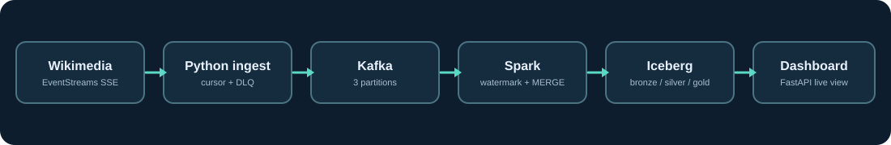

# WikiPulse

**Which live Wikipedia edits should a human patroller inspect first?** WikiPulse consumes Wikimedia's public [recent-change stream](https://wikitech.wikimedia.org/wiki/Event_Platform/EventStreams), orders edits with an explainable review score, and surfaces likely edit wars, edit bursts, and bot bursts. The result is a live dashboard backed by Kafka → Spark Structured Streaming → Apache Iceberg.

## Live demo

**[abhayjuloori.github.io/wikipulse](https://abhayjuloori.github.io/wikipulse/)** runs with no server. The page opens Wikimedia's CORS-enabled stream directly from the visitor's browser and applies the pipeline's contract, review score and alert rules, ported to TypeScript. A Python-generated parity suite checks the port against 1,500+ real captured edits. Visitors can:

- watch a ranked review queue and open the score breakdown and Wikipedia diff for any edit;
- switch wikis, or replay a 42-minute capture recorded from this pipeline's Kafka topic;
- trigger hard cases: stage an edit war, re-deliver the last microbatch (dedupe), or send an edit an hour behind the watermark (late drop), then watch the 10-second microbatch chart;
- re-weight the score and alert thresholds and see the queue re-rank.

The browser engine is a teaching mirror, not the system of record. Kafka, Spark and Iceberg remain the production path below, and the same UI switches to a **Local pipeline** mode when FastAPI serves it.

## Run locally

1. Install Docker Desktop and allocate at least 6 GB of memory. Copy `.env.example` to `.env` and replace the contact address in `WIKIPULSE_USER_AGENT` with yours; Wikimedia expects an identifiable client.
2. Run `docker compose up -d --build` from this folder. First start downloads Spark connector JARs and can take several minutes.
3. Open [http://localhost:8000](http://localhost:8000). The UI opens in **Local pipeline** mode, reading Spark's committed Iceberg snapshot. The first committed microbatch appears after the stream connects. Inspect `docker compose logs -f spark producer` if it stays empty.
4. Run `uv sync --extra dev && make test && make lint` for offline Python checks, and `make web-install web-test` for the TypeScript engine and parity tests. `make web-dev` serves the UI with hot reload on :5173 and proxies `/api` to the running stack. `make down` preserves Kafka and Iceberg data; `docker compose down -v` also removes named Docker volumes. Remove `data/`, `warehouse/`, and `checkpoints/` only when deliberately resetting the demo.

For a deterministic input sample, stop the producer (`docker compose stop producer`), set `KAFKA_BOOTSTRAP=localhost:9092`, and run `make replay`. This shifts fixture event timestamps to the current minute while preserving event IDs and spacing, so the sample is inside the live watermark. The fixture includes an additive unknown JSON field and edit-war-like comments. Replaying it twice should leave four distinct silver rows with those fixture event IDs. Restart the live source with `docker compose start producer`.

## What the dashboard means

| View | Definition | Limit |
| --- | --- | --- |
| Review queue | Edits from the last 10 minutes of stream time, ranked by a 0–100 heuristic score | Score is an ordering aid, not a vandalism probability |
| Edit war | ≥3 revert-like edit summaries and ≥2 editors on a page over a five-minute lookback | Summaries are language-limited hints; they do not prove a revert |
| Edit burst | ≥8 edits and ≥3 editors on one page in five minutes | Busy legitimate pages can trigger |
| Bot burst | ≥12 bot-flagged edits and ≤2 editors on one page in five minutes | This is page-local, not a wiki-wide bot-flood detector |
| Throughput | Silver rows in each 10-second microbatch | This is processed volume, not total Wikimedia traffic |

The score is `20 + 25 if logged out + 20 if the summary looks like a revert + min(bytes changed / 100, 25) − 10 if bot`. "Logged out" covers IPv4, IPv6 and the temporary-account names (`~2026-54044-77`) English Wikipedia now shows instead of IPs.

The API exposes `/api/dashboard`, `/api/queue`, `/api/alerts`, `/api/metrics`, and `/api/health`. The dashboard polls every five seconds. It serves an atomic JSON cache exported *after* silver and alert Iceberg commits, so the browser need not run a Spark query per refresh.

## Hard cases demonstrated

- **Duplicate delivery and restart:** The producer advances its SSE cursor only after Kafka acknowledges a message. A crash between acknowledgement and cursor persistence can replay an event. Bronze merges by `(topic, partition, offset)`; silver merges by Wikimedia `meta.id`; alerts merge by deterministic page/minute/type ID. Spark checkpoints preserve source offsets and deduplication state. These independent tables are *eventually consistent*, not a single atomic multi-table transaction.
- **Late and out-of-order edits:** Silver uses an event-time 10-minute watermark and `dropDuplicatesWithinWatermark`. Spark's dropped-by-watermark count and current watermark appear in `/api/metrics`. Events beyond the watermark are intentionally excluded from silver; all accepted Kafka payloads remain in bronze for audit or a separate backfill. The five-minute anomaly lookback uses event time and recomputes touched pages after each batch.
- **Schema changes:** Bronze stores the entire JSON payload, including unfamiliar fields and the source `$schema` URI. Silver selects an explicit stable contract. The fixture's `future_optional_field` shows that additive source fields do not break parsing. `make schema-demo` pauses the writer, adds a nullable `analyst_note` Iceberg column, and restarts it; named-column MERGEs and readers still work. Breaking changes to required fields go to the producer DLQ and need a versioned parser and checkpoint migration.

See [architecture](docs/architecture.md), [methodology and tradeoffs](docs/methodology.md), the [operations runbook](docs/runbook.md), and the [verification record](docs/verification.md). The implementation is a local single-broker portfolio system; there are no published model-quality claims or fabricated performance results.

## Verification status

Offline parser and ingestion tests run without Kafka, Spark, or network. `web/tests/parity.test.ts` replays vectors produced by `src/wikipulse/events.py` (fixtures, edge cases and real captured edits) through the TypeScript port and requires identical parse, score, revert-hint and anonymous-editor results. `make capture` refreshes both the demo's recorded capture and those vectors from a running stack. A full Docker integration smoke test requires a running Docker daemon and live network access. Exact commands and expected assertions are in the runbook.

## Sources

- [Wikimedia EventStreams documentation](https://wikitech.wikimedia.org/wiki/Event_Platform/EventStreams)
- [Spark Structured Streaming watermark and deduplication guide](https://spark.apache.org/docs/4.0.4/streaming/apis-on-dataframes-and-datasets.html)
- [Iceberg Spark Structured Streaming guide](https://iceberg.apache.org/docs/latest/spark-structured-streaming/)
- [Iceberg Spark engine compatibility](https://iceberg.apache.org/docs/latest/multi-engine-support/)
